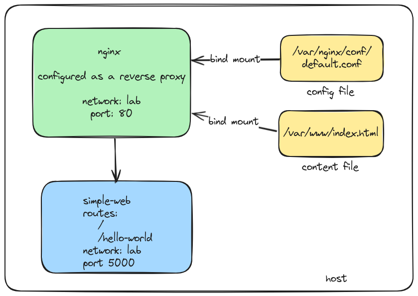

# README

In this lab we are going to configure a `nginx` server as a reverse proxy. The `nginx` server will run in a network called `lab` and will listen on port `80`. It will forward the requests to the `flask` server running on port `5000`, that is also running in the `lab` network. The diagram below shows the configuration of the `nginx` server and the `flask` server, and how they are connected.



## What are we doing?

The `nginx` reverse proxy server is configured by its configuration file. The configuration file is located at `/etc/nginx/nginx.conf` on the container, but we are using a bind mount to `/var/nginx/conf/default.conf`.  This allows us to modify the configuration file on the host and the changes will be reflected in the container.

You will need to have the `simple-web` container image. Remember, you can check if the `simple-web` image is available by running the following command:

```
docker images
```
If you don't see the `simple-web` image, you can build it by running the following command from the `container-app-workshop/simple-web` directory:

```
docker build -t simple-web .
```

This command will build the `simple-web` image and tag it as `simple-web`. You can verify that the image was created by running the `docker images` command again. Remember to return to the `nginx` directory to run the commands in this lab.

### nginx Configuration file

This file is configured to add a new server block that listens on port `80` and forwards the requests to the `flask` server. The `simple-web` configuration that the `flask` server is running on port `5000`, and has two routes: `/` and `/hello-world`.

The `nginx` server is configured to proxy to both routes. The configuration file is as follows:

```nginx
server {
    listen 80;
    listen [::]:80;
    server_name localhost lab.example.com;

    location / {
        proxy_pass http://172.17.0.3:5000;
    }

    location /hello-world {
        proxy_pass http://172.17.0.3:5000/hello-world;
    }
}
```
### nginx Content file

We are also using a bind mount to `/var/nginx/html/index.html` to serve a custom `index.html` file. This file is served when the `nginx` server receives a request to the root path `/`. We are using a simple `index.html` file with the links to the two routes of the `flask` server.

We are using the bind mount for the content file for the same reason we are using it for the configuration file. This allows us to modify the content file on the host and the changes will be reflected in the container.

## Docker Compose

Up until now, we've created containers with a Dockerfile or directly from the command line. In this step, we are going to use `docker-compose` to create everything we need for the containers. This makes deployment easier, more manageable, and repeatable.

The `docker-compose.yaml` file is configured to create the `nginx` and `simple-web` containers, and the `lab` network. The `nginx` container is configured to use the bind mounts for the configuration and content files. The `simple-web` container is configured to use the `simple-web` image that we created in the previous lab. You can click on the arrow to expand the `docker-compose.yaml` file to see the configuration. The `docker-compose.yaml` file is found in this directory: `container-app-workshop/lesson_2/`.


<details>
<summary>docker-compose.yaml</summary>

```yaml
name: nginx-lab
services:
    nginx:
        image: nginx
        container_name: nginx
        hostname: nginx
        volumes:
            # content
            - type: bind
              source: /var/www
              target: /usr/share/nginx/html
              read_only: true
            
            # nginx config files  
            - type: bind
              source: /var/nginx/conf
              target: /etc/nginx/conf.d
              read_only: true
        ports:
            - "80:80"
        networks:
           - lab
    simple-web:
        image: simple-web
        container_name: simple-web
        ports:
            - "5000:5000"
        networks:
            - lab

networks:
   lab:
      external: false
      driver: bridge
      name: lab
```
</details>


Documentation for `docker-compose` can be found [here](https://docs.docker.com/compose/).

#### Note: 

- You may have to pick a different port for the `simple-web` server if you are already using port `5000` on your host. You can change the port in the `docker-compose.yaml` file. But Flask is configured to run on port `5000` by default, so you will need to change the port in the `docker-compose.yaml` file to `5001:5000` if you want to run it on port `5001` on your host.

- You can use Docker Desktop or the Docker CLI to find the information you need to update the configuration files. You will need the IP address of the `nginx` and `simple-web` servers to update the configuration files. 

- The instructions below will show you how to get the IP address of the containers using the Docker CLI.

## Remember our bind mounts

Remember that we are using bind mounts for the configuration and content files. Update the IP address in the `default.conf` file and the `index.html` file to match the IP address of your `simple-web` server.

- create the `/var/nginx/conf/` directory on your host
- copy the `default.conf` file from the `nginx` directory to `/var/nginx/conf/`
- create the `/var/www/` directory on your host
- copy the `index.html` file from the `nginx` directory to `/var/www/`

Now our files are in place to configure the `nginx` server, but we have to restart the `nginx` server to pick up the changes.

## Start the containers

To start the containers, run the following command from the `container-app-workshop/lesson_2` directory:

```
docker compose up -d
```

### How do I know the simple-web and nginx servers are running?

You can verify that the `simple-web` and `nginx` servers are running by running the following command:

```
docker ps
``` 

:white_check_mark: You should see the containers are running. The `simple-web` container should be listening on port `5000`, and the `nginx` container should be listening on port `80`.


## Networking 

You can use the following command to see the networks that are created by `docker-compose`:
```
docker network inspect lab 
``` 

### Get the IP address of the containers

To get the IP address of the `simple-web` contianer, run the following command:
```
docker inspect \
  -f '{{range.NetworkSettings.Networks}}{{.IPAddress}}{{end}}' simple-web
```

#### Get the IP address of both the `nginx` and `simple-web` servers. You will need this information later to update the configuration files.


```
docker restart nginx
```

## Testing the servers

It's always a good idea to test that things are working as expected. So let's test the `simple-web` server first.

### Test the simple-web server from the browser

- Run the following command to get the IP address of the `simple-web` container:

```
docker inspect \
  -f '{{range.NetworkSettings.Networks}}{{.IPAddress}}{{end}}' simple-web
```
- Open a browser and navigate to `http://<IP address of your simple-web server>:5000`. You should see the `You're home now!` message from the `simple-web` server. Change the port number to what you configured in the `docker-compose.yaml` file if you changed it.
- Now navigate to `http://<IP address of your simple-web server>:5000/hello-world`. You should see the `Hello-world` message from the `simple-web` server.

:white_check_mark: Now that we know that the `simple-web` server is running, we can test the `nginx` server.


## Testing the nginx server

To test the `nginx` server, open a browser and navigate to `http://<IP address of your nginx server>`. You should see the `index.html` file that we created in the `nginx` content file. This file has links to the two routes of the `flask` server running in the `simple-web` container.


### It might not work

It might not work because the IP addresses in the `default.conf` file and the `index.html` file are hardcoded. You will need to update the IP addresses in these files to match the IP address of your `simple-web` server.

We used the bind mounts for this very reason. You can edit and update the files on your computer and the changes will be reflected in the container.

### Update the configuration files

- Make sure the links in the `index.html` file match the IP address of your `simple-web` server. 
- Update the links in your `/var/www/index.html` file and the address in the `/var/nginx/default.conf` file to match the IP address of your `simple-web` server.
- Restart the `nginx` server to pick up the changes.


Restart the `nginx` server by running the following command:

```
docker restart nginx
```

:white_check_mark: Now open a browser tab and enter the address of your `nginx` server. For example `http://172.19.0.2`. You should see the `index.html` file with the links to the two routes of the `flask` server. Click on the links to test the routes.

:white_check_mark: You should see the `You're home now!` message from the `simple-web/` link.and the `Hello, World!` message from the `simple-web/hello-world` link.

Whew! That was a lot of work. But you did it! You configured an `nginx` server as a reverse proxy to a `flask` server. You used bind mounts to update the configuration and content files on your host.

## What Next?

:white_check_mark: [Chainguard](https://chainguard.dev) provides a secure `nginx` [image that is built from scratch](https://console.chainguard.dev/org/welcome/images/public/image/nginx/versions). You can use this image to test your understanding of how to use `docker-compose` to change the container image.

You can use the following command to rebuild the `nginx` container after you make changes to the `docker-compose.yaml` file:

```
- docker-compose up --build --remove-orphans --force-recreate -d
```

## Why is this important?

- You learned how to configure a reverse proxy using `nginx` and how to use bind mounts to update the configuration and content files on your host.
- You learned how to use `docker-compose` to create containers and networks.
- You learned how to use the `docker inspect` command to get the IP address of a container.
- You learned how to use the `docker ps` command to check the status of the containers.
- You learned how to use the `docker restart` command to restart a container.
- You learned how to use the `docker network inspect` command to get more information about the network.
- You learned how to use the `docker-compose up --build` command to rebuild the containers after you make changes to the `docker-compose.yaml` file.
- You learned hwo to use a bind mouunt to update the configuration and content files on your host.

## Summary

At this point it should be clear to you that there are several layers of abstraction when it comes to containers:

- You have the container image, the container, the network, and the host. 
- You have host ports and container ports. 
- You have virtal networks and IP addresses. 
- You have bind mounts and volumes.

You can use these layers to create a secure and isolated environment for your applications, but it can be confusing at first. It definitely helps to have a diagram to help you understand how everything fits together, so if you get confused, create a diagram to help you understand the relationships between the different components.

## Next Steps

In the next lesson, we will learn how to use a container to test connections between containers. 

