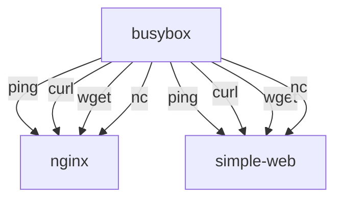

# README.md

## Learning how to troubleshoot network issues with busybox

Containerization introduces several layers of abstraction, which can make it difficult to troubleshoot network issues. In this lesson, you will learn how to use the `busybox` container to troubleshoot network issues in a containerized environment.

### What is busybox?

The `busybox` container is a lightweight container that includes a minimal set of Unix utilities. It is often used for debugging and troubleshooting purposes because it is small and easy to use.

## What will you learn?

In the previous lesson, you created a simple web server using a container running `Flask`, and a `nginx` reverse proxy. In this lesson, you will learn how to troubleshoot network issues using a `busybox` container.

- You will connect to the `busybox` container using `docker exec` and run commands to test network connectivity. 
- You will learn to use the `ping` command to test network connectivity between the `busybox` and the `nginx`container and `simple-web` container.
- You will learn to use the `curl` command to test network connectivity between the `busybox` and `nginx` container.
- You will learn to use the `wget` command to test network connectivity between the `busybox` and `nginx` and `Flask` web server running in the `simple-web` container.
- You will learn to use the `nc` command to test network connectivity between the `busybox` and `nginx` and `Flask` web server running in the `simple-web` container.

### Diagram

It helps to have a diagram of what you are trying to achieve - especially when troubleshooting. The diagram below shows the network connectivity between the `busybox` container and the `nginx` and `simple-web` containers. The `busybox` container will be used to test network connectivity between the `nginx` and `simple-web` containers.



All of the containers need to be running on the same virtual network. We will use the `docker-compose` file from the previous lesson to create the containers. The `docker-compose` file will create a network called `lab` and connect all of the containers to that network. 

## Prerequisites

- You should have Docker installed on your machine.
- You should have Docker Compose installed on your machine.
- You should have a basic understanding of Docker and Docker Compose.
- You should have a basic understanding of networking concepts such as IP addresses, ports, and protocols.
- You should have a basic understanding of the command line and how to run commands in a terminal.

## Getting Started

You should have completed the previous lesson and have the `docker-compose` file from that lesson. If you have not completed the previous lesson, please do so before continuing with this lesson.

Assuming you have completed the pervious lesson, you should have the `simple-web` and `nginx` containers running. You can check the status of the containers by running the following command in the terminal:

```
docker ps
```

If they aren't running, you can start them by running the `docker-compose up` command in the terminal. You will need to run it from the `lesson_2` directory or specifiy the directory This will start the containers and create the network. You should see output similar to the following:

```
docker-compose up
```

Verify that the containers are running before continuing. 

## Start the busybox container from the command line

We won't be using the `docker-compose` file to start the `busybox` container. Instead, we will start the `busybox` container from the command line. This will allow us to run commands in the `busybox` container and test network connectivity between the `busybox` container and the other containers. We also don't want to keep the `busybox` container running all the time, so we will start it and stop it as needed.

```bash
docker run -it --rm --network lab --name busybox busybox
```

This command will start the `busybox` container and connect it to the `lab` network. The `-it` flag will allow you to interact with the container, and the `--rm` flag will remove the container when it is stopped. The `--name` flag will give the container a name so that you can easily reference it later.


## Test network connectivity with ping

The `ping` command is used to test network connectivity between two hosts. It sends ICMP echo request packets to the specified host and waits for a response. If the host is reachable, it will respond with an ICMP echo reply packet.

We can `ping` using the IP address of the container or the name of the container. The name of the container is the name that you specified when you started the container. In this case, we will use the name of the container to `ping` it.

### Ping the nginx container
```bash
ping nginx
```
### Ping the simple-web container
```bash
ping simple-web
```

