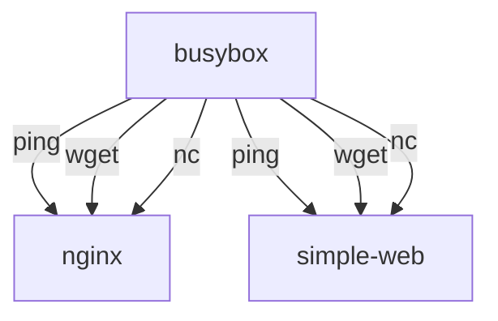

# README.md

## Learning how to test and troubleshoot network issues with busybox

Containerization introduces several layers of abstraction, which can make it difficult to troubleshoot network issues. In this lesson, you will learn how to use the `busybox` container to troubleshoot network issues in a containerized environment.

### What is busybox?

The `busybox` container is a lightweight container that includes a minimal set of Unix utilities. It is often used for debugging and troubleshooting purposes because it is small and easy to use.

## What will you learn?

In the previous lesson, you created a simple web server using a container running `Flask`, and a `nginx` reverse proxy. In this lesson, you will learn how to troubleshoot network issues using a `busybox` container.

- You will connect to the `busybox` container using `docker exec` and run commands to test network connectivity. 
- You will learn to use the `ping` command to test network connectivity between the `busybox` and the `nginx`container and `simple-web` container.
- You will learn to use the `wget` command to test network connectivity between the `busybox` and `nginx` and `Flask` web server running in the `simple-web` container.
- You will learn to use the `nc` command to test network connectivity between the `busybox` and `nginx` and `Flask` web server running in the `simple-web` container.

### Diagram

It helps to have a diagram of what you are trying to achieve - especially when troubleshooting. The diagram below shows the network connectivity between the `busybox` container and the `nginx` and `simple-web` containers. The `busybox` container will be used to test network connectivity between the `nginx` and `simple-web` containers.



All of the containers need to be running on the same virtual network. We will use the `docker-compose` file from the previous lesson to create the containers. The `docker-compose` file will create a network called `lab` and connect all of the containers to that network. 

## Prerequisites

- You should have Docker installed on your machine.
- You should have Docker Compose installed on your machine.
- You should have a basic understanding of Docker and Docker Compose.
- You should have a basic understanding of networking concepts such as IP addresses, ports, and protocols.
- You should have a basic understanding of the command line and how to run commands in a terminal.

## Getting Started

You should have completed the previous lesson and have the `docker-compose.yaml` file from that lesson. If you have not completed the previous lesson, please do so before continuing with this lesson.

Assuming you have completed the pervious lesson, you should have the `simple-web` and `nginx` containers running. You can check the status of the containers by running the following command in the terminal:

```
docker ps
```

If they aren't running, you can start them by running the `docker compose up -d` command in the terminal. You will need to run it from the `lesson_2` directory or specifiy the directory as in the command below. This will start the containers and create the network.

```
docker compose up -f ../lesson_2/docker-compose.yaml up -d
```

Verify that the containers are running before continuing. 

## Start the busybox container from the command line

We won't be using the `docker-compose` file to start the `busybox` container. Instead, we will start the `busybox` container from the command line. This will allow us to run commands in the `busybox` container and test network connectivity between the `busybox` container and the other containers. We also don't want to keep the `busybox` container running all the time, so we will start it and stop it as needed.

```bash
docker run -it --rm --network lab --name busybox busybox
```

This command will start the `busybox` container and connect it to the `lab` network. The `-it` flag will allow you to interact with the container, and the `--rm` flag will remove the container when it is stopped. The `--name` flag will give the container a name so that you can easily reference it later.


## Test network connectivity with ping

The `ping` command is used to test network connectivity between two hosts. It sends ICMP echo request packets to the specified host and waits for a response. If the host is reachable, it will respond with an ICMP echo reply packet.

We can `ping` using the IP address of the container or the name of the container. The name of the container is the name that you specified when you started the container. In this case, we will use the name of the container to `ping` it.

You can use the `docker inspect` command to get the DNS name of the container. The DNS name is the name that you can use to `ping` the container. The DNS name is the same as the name of the container, but it is in lowercase and has a `.` instead of a `_`. For example, if the name of the container is `nginx`, the DNS name is `nginx`.

And as we learned in previous lessons, you can get the IP address of the container by running the following command:

```bash
docker inspect -f '{{range .NetworkSettings.Networks}}{{.IPAddress}}{{end}}' nginx
```

### Ping the nginx container from busybox
```bash
ping nginx
```

Use `Ctrl + C` to stop the ping command.

### Ping the simple-web container from busybox
```bash
ping simple-web
```

Use `Ctrl + C` to stop the ping command.

If you get a response from the `ping` command, it means that the container is reachable and there are no network issues. If you do not get a response, it means that there is a network issue and you will need to troubleshoot the issue. 

#### Things to try if you don't get a response:

- Check the status of the containers by running the `docker ps` command. Make sure that the containers are running and connected to the same network.
- Check the network settings of the containers by running the `docker inspect` command. Make sure that the containers are connected to the same network and have the correct IP addresses.
- Check the container's DNS names by running the `docker inspect` command. Make sure that the DNS names are correct and that you are using the correct names to `ping` the containers.

## Test the network connectivity with nc

`nc` (netcat) is a command-line utility for reading and writing data across network connections. It can be used to test network connectivity by trying to connect to a specific port on a web server. If the connection is successful, it means that the web server is reachable and there are no network issues.

We know that the `nginx` container is running on port `80` and the `Flask` web server is running on port `5000`. We can use `nc` to test network connectivity to these ports.

### Test network connectivity with nc to the nginx container from busybox
```bash
nc -zv nginx 80
```
* The `-z` flag tells `nc` to scan for listening daemons without sending any data to them.
* The `-v` flag tells `nc` to be verbose and output information about the connection attempt.
* The `nginx` argument is the name of the container that you want to connect to. You can also use the IP address of the container instead of the name.

You should see output similar to the following:

```Connection to nginx 80 port [tcp/http] succeeded!
```
If you see this message or one like it, it means that the `nginx` container is reachable and there are no network issues. If you do not see this message, it means that there is a network issue and you will need to troubleshoot the issue.

#### Things to try if you don't get a response:

- Check the status of the containers by running the `docker ps` command. Make sure that the containers are running and connected to the same network.
- Check the network settings of the containers by running the `docker inspect` command. Make sure that the containers are connected to the same network and have the correct IP addresses.
- Check the `nginx` configuration file is in the correct location on your computer (per the `docker-compose` file). 
- Check the `nginx` logs for any errors. You can view the logs by running the following command:

```bash
docker logs nginx
```

### Test network connectivity with nc to the simple-web container from busybox
```bash
nc -zv simple-web 5000
```
* The `5000` is the port number that the `Flask` web server is running on.

#### Things to try if you don't get a response:

- Check the status of the containers by running the `docker ps` command. Make sure that the containers are running and connected to the same network (`lab`).
- Check the network settings of the containers by running the `docker inspect` command. Make sure that the containers are connected to the same network and have the correct IP addresses.
- Check the `Flask` web server is running on port `5000`. You can check this by running the following command:

```bash
docker logs simple-web
```
* You should see output similar to the following:

```bash
 * Running on http://
```

## Test network connectivity with wget

`wget` is a command-line utility for downloading files from the web. It can also be used to test network connectivity by trying to download a file from a web server. If the file is downloaded successfully, it means that the web server is reachable and there are no network issues.

You can use `wget` to test network connectivity between the `busybox` container and the `nginx` and `simple-web` containers.

### Test network connectivity with wget to the nginx container from busybox
```bash
wget -qO- nginx
```
* The `-q` flag tells `wget` to be quiet and not output anything to the terminal.
* The `-O-` flag tells `wget` to output the downloaded file to standard output (the terminal) instead of saving it to a file. This is useful for testing network connectivity because you can see the output of the command without having to save the file.
* The `nginx` argument is the name of the container that you want to download the file from. You can also use the IP address of the container instead of the name.

You should see the simple HTML page that is served by the `nginx` container with the links to the 2 routes on the `Flask` web server. The `nginx` container is acting as a reverse proxy and forwarding requests to the `Flask` web server running in the `simple-web` container.

### Test network connectivity with wget to the simple-web container from busybox
```bash
wget -qO- simple-web:5000
```

* `5000` is the port number that the `Flask` web server is running on.

And if you remember, we have 2 routes on the `Flask` web server. The `/` route returns a simple HTML page saying `You're home now!` and the `hello-world` route returns `Hello World` web page.

```bash
wget -qO- simple-web:5000/hello-world
```

## Test with the browser

You have verified that all of the network connections are working! Now it's time to test with the browser. You can find the IP address of the `nginx` container by running the following command from your computer terminal:

```bash
docker inspect -f '{{range .NetworkSettings.Networks}}{{.IPAddress}}{{end}}' nginx
```
Enter the IP address of the `nginx` container in the browser and you should see the simple HTML page that is served by the `nginx` container with the links to the 2 routes on the `Flask` web server. The `nginx` container is acting as a reverse proxy and forwarding requests to the `Flask` web server running in the `simple-web` container.


## Stop the busybox container

Exit from the `busybox` container by running the following command:

```bash
exit
```

This will stop the `busybox` container and remove it from the network. That's why we used the `--rm` flag when we started the `busybox` container.

## Stop the containers using docker compose

You can stop the containers by running the following command:

```bash
docker compose -f ../lesson_2/docker-compose.yaml down
```
## Conclusion

You have learned many valuable tools to test the network connectivity between containers. And you have learned to take a systematic approach to troubleshooting network issues. 

- You learned to create a diagram to help you visualize the network connectivity between the containers.
- You learned to use the `ping` command to test network connectivity between the `busybox` and the `nginx` and `simple-web` containers.
- You learned to use the `nc` command to test network connectivity between the `busybox` and the `nginx` and `simple-web` containers.
- You learned to use the `wget` command to test network connectivity between the `busybox` and the `nginx` and `simple-web` containers.
- You learned to use the `docker inspect` command to get the IP address and DNS name of the containers.
- You learned to use the `docker logs` command to view the logs of the containers.
- You learned to use the `docker ps` command to check the status of the containers.
- You learned to use the `docker exec` command to run commands in the `busybox` container.
- You learned to use the `docker-compose` file to create and manage the containers.
- You learned to use the `docker-compose up -d` command to start the containers and create the network.
- You learned to use the `docker-compose down` command to stop and remove the containers and the network.
