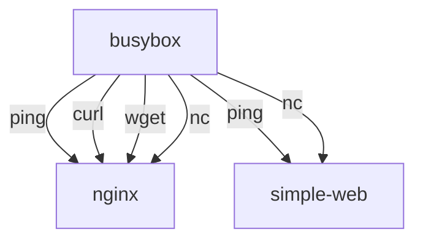

# README.md

## Learing how to troubleshoot network issues with busybox

Containerization introduces several layers of abstraction, which can make it difficult to troubleshoot network issues. In this lesson, you will learn how to use the `busybox` container to troubleshoot network issues in a containerized environment.

### What is busybox?

The `busybox` container is a lightweight container that includes a minimal set of Unix utilities. It is often used for debugging and troubleshooting purposes because it is small and easy to use.

## What will you learn?

In the previous lesson, you created a simple web server using a container running `Flask`, and a `nginx` reverse proxy. In this lesson, you will learn how to troubleshoot network issues using a `busybox` container.

- You will connect to the `busybox` container using `docker exec` and run commands to test network connectivity. 
- You will learn to use the `ping` command to test network connectivity between the `busybox` and the `nginx`container and `simple-web` container.
- You will learn to use the `curl` command to test network connectivity between the `busybox` and `nginx` container.
- You will learn to use the `wget` command to test network connectivity between the `busybox` and `nginx` and `Flask` web server running in the `simple-web` container.
- You will learn to use the `nc` command to test network connectivity between the `busybox` and `nginx` and `Flask` web server running in the `simple-web` container.

### Diagram

It helps to have a diagram of what you are trying to achieve. The diagram below shows the network connectivity between the `busybox` container and the `nginx` and `simple-web` containers. The `busybox` container will be used to test network connectivity between the `nginx` and `simple-web` containers.

All of the containers need to be running on the same virtual network. We will use the `docker-compose` file from the previous lesson to create the containers. The `docker-compose` file will create a network called `lab` and connect all of the containers to that network. 

