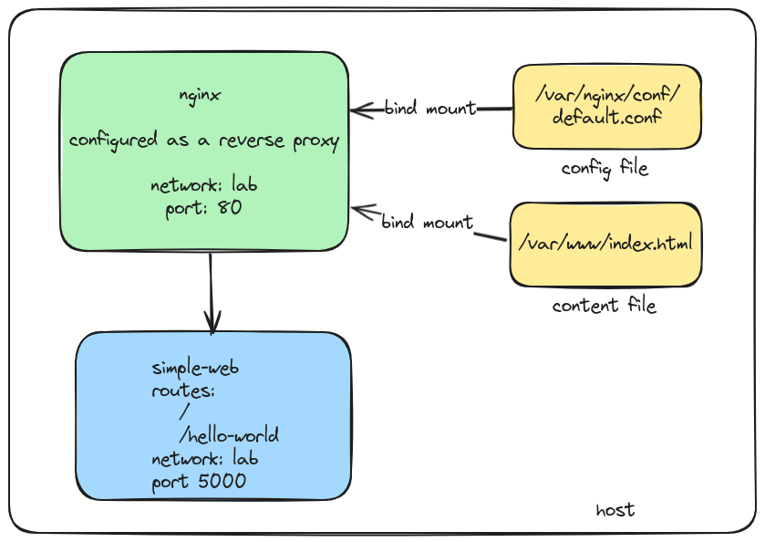

# README

In this lab we are going to configure a `nginx` server as a reverse proxy. The `nginx` server will run in a network called `lab` and will listen on port `80`. It will forward the requests to the `flask` server running on port `5000`, that is also running in the `lab` network.



## What are we doing?

The `nginx` reverse proxy server is configured by its configuration file. The configuration file is located at `/etc/nginx/nginx.conf` on the container, but we are using a bind mount to `/var/nginx/conf/default.conf`.  This allows us to modify the configuration file on the host and the changes will be reflected in the container.

We're assuming you've already created the `simple-web` container image. If you haven't, please refer to the [simple-web](../simple-web/README.md) lab for instructions on how to create the `simple-web` container image.

### nginx Configuration file

This file is configured to add a new server block that listens on port `80` and forwards the requests to the `flask` server. The `simple-web` configuration that the `flask` server is running on port `5000`, and has two routes: `/` and `/hello-world`.

The `nginx` server is configured to proxy to both routes. The configuration file is as follows:

```nginx
server {
    listen 80;
    listen [::]:80;
    server_name localhost lab.example.com;

    location / {
        proxy_pass http://172.17.0.3:5000;
    }

    location /hello-world {
        proxy_pass http://172.17.0.3:5000/hello-world;
    }
}
```
### nginx Content file

We are also using a bind mount to `/var/nginx/html/index.html` to serve a custom `index.html` file. This file is served when the `nginx` server receives a request to the root path `/`. We are using a simple `index.html` file with the links to the two routes of the `flask` server.

We are using the bind mount for the content file for the same reason we are using it for the configuration file. This allows us to modify the content file on the host and the changes will be reflected in the container.

## Docker Compose

Up until now, we've created containers with a Dockerfile or directly from the command line. In this step, we are going to use `docker-compose` to create everything we need for the containers. Both the `simple-web` and the `nginx` containers, and the `lab` network configuration are in the `docker compose` file. The `docker-compose` file is located at `docker-compose.yaml` in the root of this repository.

<details>
<summary>docker-compose.yaml</summary>

```yaml
name: nginx-lab
services:
    nginx:
        image: nginx
        container_name: nginx
        hostname: nginx
        volumes:
            # content
            - type: bind
              source: /var/www
              target: /usr/share/nginx/html
              read_only: true
            
            # nginx config files  
            - type: bind
              source: /var/nginx/conf
              target: /etc/nginx/conf.d
              read_only: true
        ports:
            - "80:80"
        networks:
           - lab
    simple-web:
        image: simple-web
        container_name: simple-web
        ports:
            - "5000:5000"
        networks:
            - lab

networks:
   lab:
      external: false
      driver: bridge
      name: lab
```
</details>


Documentation for `docker-compose` can be found [here](https://docs.docker.com/compose/).

#### Note: 

- You may have to pick a different port for the `simple-web` server if you are already using port `5000` on your host. You can change the port in the `docker-compose.yaml` file. But Flask is configured to run on port `5000` by default, so you will need to change the port in the `docker-compose.yaml` file to `5001:5000` if you want to run it on port `5001` on your host.

- You can use Docker Desktop or the Docker CLI to find the information you need to update the configuration files. You will need the IP address of the `nginx` and `simple-web` servers to update the configuration files. 

- The instructions below will show you how to get the IP address of the containers using the Docker CLI.

## Start the containers

To start the containers, run the following command from the `container-app-workshop/nginx/nginx` directory:

```
docker-compose up -d
```
This command will create the `simple-web` and `nginx` containers, and the `lab` network. The `-d` command runs the containers in the background. You can verify that the containers are running by running the 
```
docker ps
``` 
command and checking the status of the `nginx` and `simple-web` containers.

:white_check_mark: You should see the `nginx` and `simple-web` containers running. The `nginx` container should be listening on port `80`, and the `simple-web` container should be listening on port `5000`.


## Networking 

You can use the 
```
docker network inspect lab 
``` 
command to get more information about the network, including the containers that are connected to it.

### Get the IP address of the containers

To get the IP address of the `simple-web` contianer, you can run the 
```
docker inspect \
  -f '{{range.NetworkSettings.Networks}}{{.IPAddress}}{{end}}' simple-web
```

#### Get the IP address of both the `nginx` and `simple-web` servers. You will need this information later to update the configuration files.


### Remember our bind mounts

Remember that we are using bind mounts for the configuration and content files. Update the IP address in the `default.conf` file and the `index.html` file to match the IP address of your `simple-web` server.

- create the `/var/nginx/conf/` directory on your host
- copy the `default.conf` file from the nginx directory to `/var/nginx/conf/`
- create the `/var/www/` directory on your host
- copy the `index.html` file from the nginx directory to `/var/www/`

Now our files are in place to configure the `nginx` server, but we have to restart the `nginx` server to pick up the changes.

```
docker restart nginx
```

### How do I know the simple-web server is running?

You can verify that the `simple-web` server is running by running the following command:

```
docker ps
``` 
This command will show you the list of running containers. You should see the `simple-web` container running.

:white_check_mark: You should see the `simple-web` container running. The `simple-web` container should be listening on port `5000`, and the `nginx` container should be listening on port `80`.

### Test the simple-web server from the browser

- Run the following command to get the IP address of the `simple-web` container:

```
docker inspect \
  -f '{{range.NetworkSettings.Networks}}{{.IPAddress}}{{end}}' simple-web
```
- Open a browser and navigate to `http://<IP address of your simple-web server>:5000`. You should see the `Hello, World!` message from the `simple-web` server. Change the port number to what you configured in the `docker-compose.yaml` file if you changed it.
- Now navigate to `http://<IP address of your simple-web server>:5000/hello-world`. You should see the `You're home now!` message from the `simple-web` server.

:white_check_mark: Now that we know that the `simple-web` server is running, we can test the `nginx` server.


## Testing the nginx server

To test the `nginx` server, open a browser and navigate to `http://<IP address of your nginx server>`. You should see the `index.html` file that we created in the `nginx` content file. This file has links to the two routes of the `flask` server running in the `simple-web` container.


### It might not work

It might not work because the IP addresses in the `default.conf` file and the `index.html` file are hardcoded. You will need to update the IP addresses in these files to match the IP address of your `simple-web` server.

We used the bind mounts for this very reason. You can update the files on your host and the changes will be reflected in the container.

### Update the configuration files

- Make sure the links in the `index.html` file match the IP address of your `simple-web` server. 
- Update the links in your `index.html` file and the address in the `default.conf` file to match the IP address of your `simple-web` server.
- Copy the files to the `/var/nginx/conf/` and `/var/nginx/html/` directories on your host. 
- Restart the `nginx` server to pick up the changes.


Restart the `nginx` server by running the following command from the `container-app-workshop/nginx/nginx` directory:

```
docker restart nginx
```

:white_check_mark: Now open a browser tab and enter the address of your `nginx` server. For example `http://172.19.0.2`. You should see the `index.html` file with the links to the two routes of the `flask` server. Click on the links to test the routes.

:white_check_mark: You should see the `You're home now!` message from the `simple-web/` link.and the `Hello, World!` message from the `simple-web/hello-world` link.

## Conclusion

Whew! That was a lot of work. But you did it! You configured an `nginx` server as a reverse proxy to a `flask` server. You used bind mounts to update the configuration and content files on your host.

You also learned about networking in Docker and how to get the IP address of a container.

And you were introduced to `docker-compose` and how to use it to create containers. 

In the next lab, we will learn about [cloudflare tunnels](https://www.cloudflare.com/products/tunnel/) and how to use them to expose your local servers to the internet. This will allow you to test your applications from anywhere in the world without having to expose your local network to the internet. 
